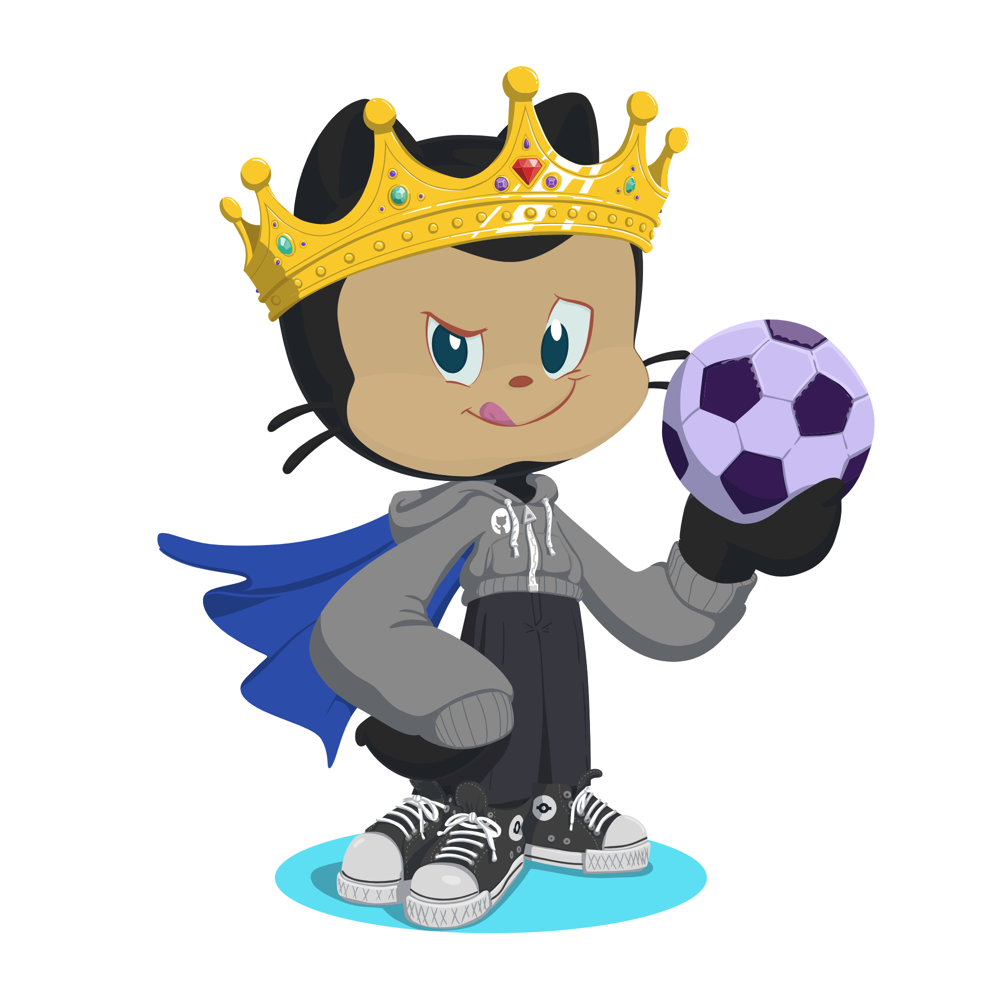

<h1>
    
     João Luiz Abreu Mião de João
</h1>

Sou um desenvolvedor full-stack de Araraquara-Sp, Brasil. Sou um apaixonado por tecnologia e em 2023 ingressei na UNIARA, no curso de Sistema de Informação. Após completar o segundo ano da faculdade, acabei ingressando na <a href="https://fatecararaquara.cps.sp.gov.br/">FATEC</a> de Araraquara, no curso de Segurança da Informação, mas, mantendo por meio de cursos online meus conhecimentos em desenvolvimento de sistemas, aperfeiçoando mais a cada dia. Atualmente, busco a minha primeira oportunidade no mercado de Tecnologia. 👾

Gosto de esportes, principalmente Futebol e Fórmula 1. Além disso, meus hobbies são treinar, ouvir música e também jogar alguns jogos eletrônicos. 👾

<h3 >Conecte-se comigo!</h3>

<a href="https://github.com/JoaoLuiz03">

<h3 >Habilidades e Linguagens mais usadas: </h3>

<h3 >Banco de dados: </h3>

<h3 >IDE's mais usadas: </h3>

  

 
 
  - Icon Bola <a href="https://www.flaticon.com/free-icons/soccer" title="soccer icons">Soccer icons created by Freepik - Flaticon</a> 
  - modelo <a href="https://github.com/elidianaandrade/elidianaandrade/blob/main/README.md?plain=1">elidianandrade</a>
 
  
Feito por <a href="https://github.com/JoaoLuiz03">João.</a>

